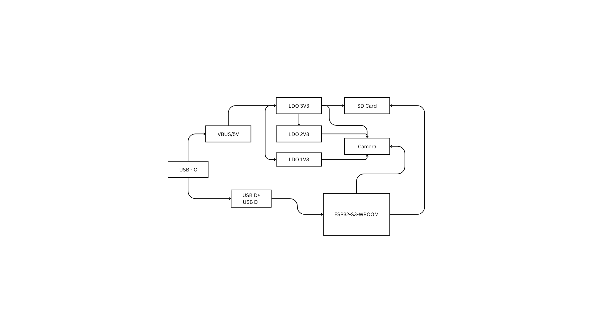
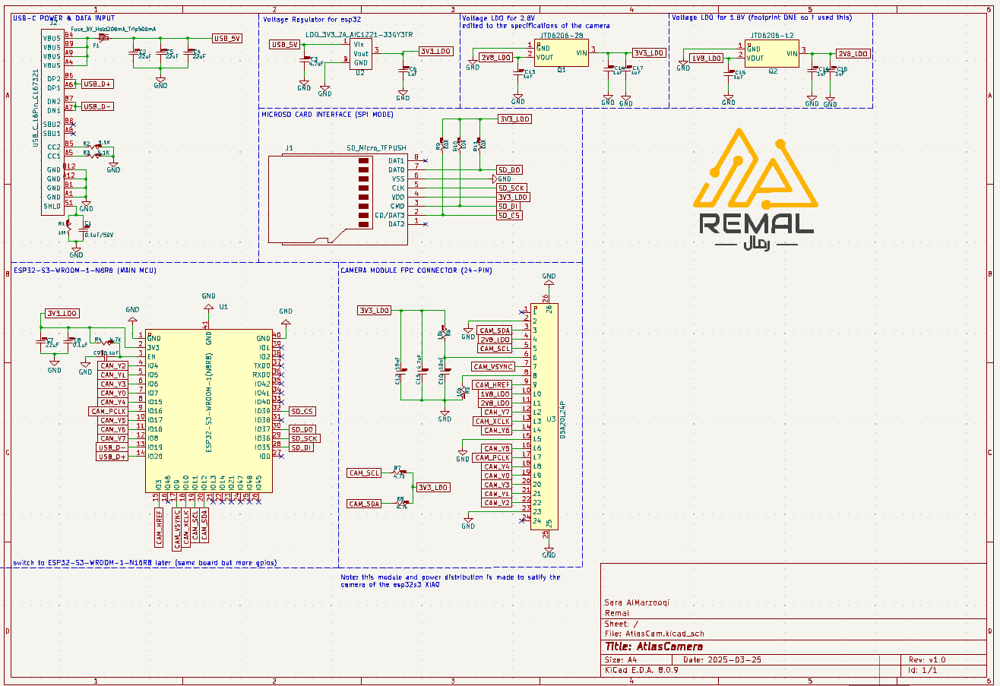
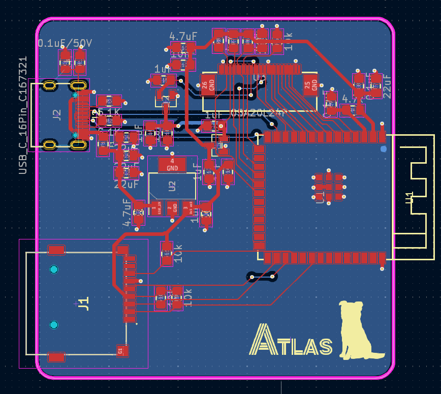

# DUT_CAM Camera Board Project
PCB designed to interface a camera module with the Atlas board to provide standalone testing for future design

## Project Overview
This board is a camera testing board that uses an OV2640 camera signals to an ESP32-S3, adds microSD storage, and includes USB-C power input with LDOs. Mainly used as a verificationnn board for later Atlas integration.

## Features
- **USB-C Power Input**: 5 V via USB-C connector
- **Power Regulation**:
  - 3.3 V LDO for ESP32-S3 and camera core
  - 2.8 V LDO for camera I/O
  - 1.2 V LDO for camera I/O
- **Camera Sensor Interface**:
  - 24-pin FPC footprint for OV2640
  - I²C (SDA/SCL) and parallel data bus (D0–D7) breakout
- **Microcontroller Footprint**: ESP32-S3-WROOM-1-N8R8 for on-board firmware testing
- **MicroSD Card Slot**: Store captured images or log data locally

## Block Diagram

## Circuit Schematic

## PCB Layout

## Usage
1. Insert a microSD card into the slot.
2. Flash and run code written for the board.
3. Open the serial monitor and note the IP address the board prints.
4. In your web browser, navigate to `http://<board_ip>/`.
5. Enjoy the live video stream.
